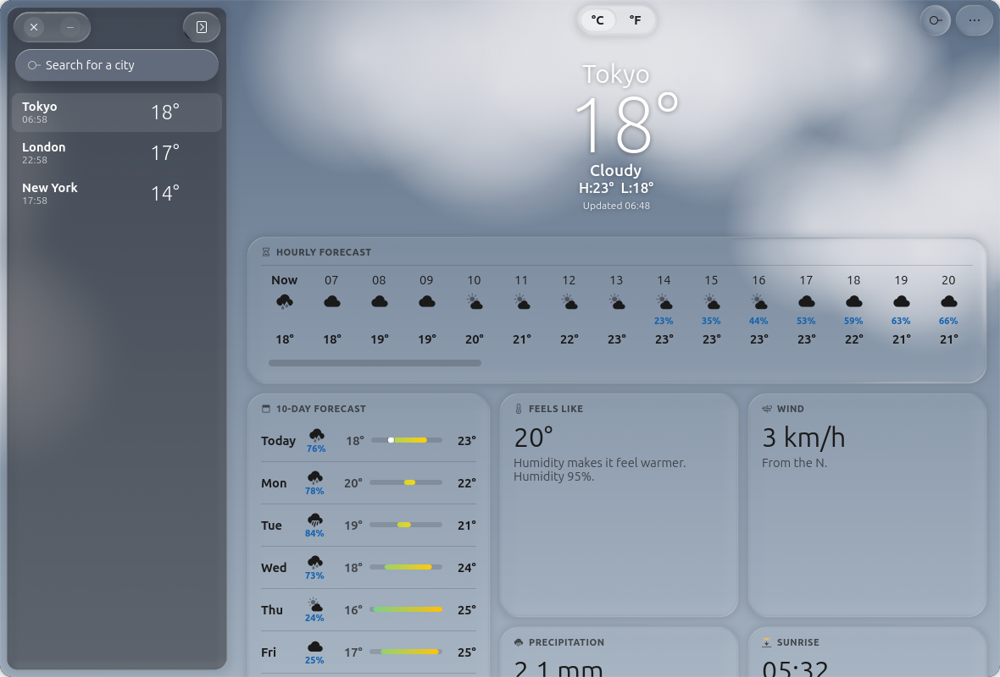
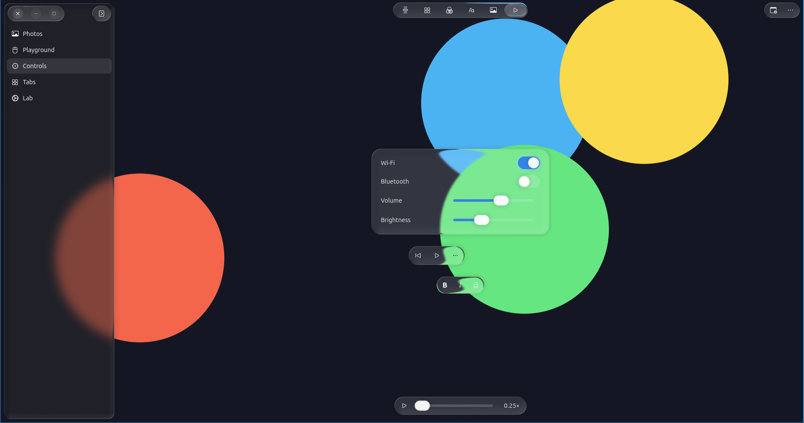
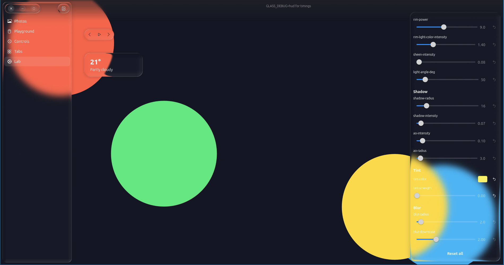

# glass-lib

Refracting, Liquid Glass–style glass for GTK 4 and libadwaita apps: panels,
bars and controls that bend, blur and tint the app's own content as it
scrolls under them — in the same frame, on any compositor.



> [!NOTE]
> **Status: early development (0.0.1).** The library, its widgets, the demos
> and the Flatpaks work; the API may still change. The design notes (in
> Japanese) are in [`docs/design.md`](docs/design.md).

> [!NOTE]
> This is an unofficial, community-driven project and is not affiliated with,
> endorsed by, or connected to Apple Inc. in any way.

> [!NOTE]
> **AI usage:** A significant part of this codebase was written with the help
> of AI coding assistants, primarily **Claude (Anthropic)**, used for
> implementation, shader and rendering debugging, and refactoring. The design,
> the architecture decisions and all of the testing on real hardware are mine,
> and every change is reviewed before it lands.

## What it provides

- **`GlassView`** and **`GlassPanel`**: glass over any content — the view draws
  every panel among its overlay children as glass that refracts what is under it.
- **Drop-in counterparts of libadwaita's widgets**: `GlassToolbarView` (bars
  floating over the content, with a scroll edge effect), `GlassHeaderBar`
  (buttons on glass capsules), `GlassSplitView` (a floating sidebar of thick
  glass), `GlassToggleGroup`, `GlassTabBar`, `GlassSearchEntry`,
  `GlassButton`, `GlassButtonGroup`, `GlassSwitch`, `GlassSlider`,
  `GlassMenuButton` / `GlassPopover` and `GlassDialog`.
- **Glass that behaves like liquid**: panels in a `GlassGroup` flow together
  like drops of water, glass morphs from one shape into another
  (`morph-id`), glass over glass refracts in layers, and presses make the
  glass swell. The plate of a toggle group can be dragged from one toggle to
  another, and it stretches like jelly as it goes.
- **Readable text**: the text and icons on the glass turn dark or light with
  what is under them.
- **The optics of the [Liquid Glass GNOME Shell extension](https://github.com/ryohsuke1231/liquid-glass)**
  (refraction, rim light, shadow), matched to measurements of macOS's glass
  and tuned for small in-app glass — and tunable: materials (regular, thick,
  clear, menu, and a tinted, frosted *prominent* one for the button that
  confirms), a thin or thick lens, and every parameter and the tint for the
  whole app or for one panel.
- **A CSS fallback** when OpenGL is unavailable, and support for high
  contrast, reduced transparency and reduced motion.
- **GJS (JavaScript / TypeScript), Python and C**, through GObject
  Introspection (namespace `Glass`).

The glass is drawn inside the application window, so it does not depend on
the compositor: it works on any Wayland compositor and on X11.

| | |
|---|---|
|  |  |

## Requirements

- GTK ≥ 4.22 and libadwaita ≥ 1.9 (GNOME 50 or later), libepoxy
- OpenGL ES 3.0 or OpenGL 3.3 for the full renderer (without it, the glass is frosted with CSS)
- To build: meson, a C compiler, gobject-introspection. For the demos: Node.js
  (TypeScript). For the API reference: [gi-docgen](https://gitlab.gnome.org/GNOME/gi-docgen).

## Building

```sh
meson setup build
meson compile -C build
meson test -C build
meson install -C build
```

| Option | Default | |
|---|---|---|
| `-Dintrospection=` | `true` | `Glass-1.gir` and `Glass-1.typelib`, for GJS and Python |
| `-Dtests=` | `true` | The tests (`meson test`) |
| `-Dexamples=` | `true` | The C example |
| `-Ddocumentation=` | `false` | The API reference, with gi-docgen (`build/docs/reference/glass-lib-1/index.html`) |
| `-Ddemos=` | `[]` | Install the demos: `gallery`, `weather` |

## Using it

```js
import Adw from 'gi://Adw?version=1';
import Gtk from 'gi://Gtk?version=4.0';
import Glass from 'gi://Glass?version=1';

// In your GApplication's activate handler:
Glass.init();

const toolbar = new Glass.ToolbarView({ content: myScrolledWindow });
const header = new Glass.HeaderBar();
header.pack_end(new Gtk.Button({ icon_name: 'open-menu-symbolic' }));
toolbar.add_top_bar(header);

// Glass anywhere over the content: a Glass.View and its overlay children.
const view = new Glass.View({ content: myPhotoGrid });
view.add_overlay(new Glass.Panel({ child: myToolbarBox, halign: Gtk.Align.CENTER,
    valign: Gtk.Align.END, margin_bottom: 16 }));

// Tuning: all the glass, or one panel.
Glass.Context.get_default().set_param(Glass.PARAM_BLUR_RADIUS, 3);
myPanel.set_lens(Glass.Lens.THICK);

// The button that confirms: tinted with the accent colour, strongly frosted.
const done = new Glass.Button({ label: 'Done', material: Glass.Material.PROMINENT });
```

- [`examples/`](examples): the same small app in C, Python and GJS.
- The API reference (`-Ddocumentation=true`) has a getting-started guide, how
  the glass works, tuning, styling and debugging.

## Demos

Two apps written in TypeScript for GJS, in [`demo/`](demo):

- **Glass Gallery**, the test bench: Photos (a grid of your own photos
  scrolling under glass),
  Playground (panels to drag over test patterns), Controls, Tabs, and the
  **Lab**, with every optical parameter and the tint as live sliders.
- **Glass Weather**, a showcase laid out like macOS's Weather: your places
  (with their local time and temperature) on a sidebar of glass, the forecast
  on cards of clear glass over a sky drawn in code, and a search button whose
  glass becomes a search field. Weather data by
  [Open-Meteo.com](https://open-meteo.com/) (CC BY 4.0, non-commercial use).

From the source tree:

```sh
meson compile -C build
cd demo && npm install && npm run build && cd ..
meson devenv -C build -w . gjs -m demo/dist/main.js           # Glass Gallery
meson devenv -C build -w . gjs -m demo/dist/weather/main.js   # Glass Weather
```

### Flatpak

Both demos build as Flatpaks on the GNOME 50 runtime:

```sh
flatpak install --user flathub org.gnome.Sdk//50 \
    org.freedesktop.Sdk.Extension.node22//25.08 org.freedesktop.Sdk.Extension.typescript//25.08
flatpak-builder --user --install --force-clean build-flatpak \
    build-aux/flatpak/io.github.ryohsuke1231.GlassWeather.json    # or ….GlassGallery.json
flatpak run io.github.ryohsuke1231.GlassWeather
```

With the `org.flatpak.Builder` Flatpak instead of a `flatpak-builder` package,
build into a repository and install with the host's `flatpak`:

```sh
flatpak run --env=FLATPAK_USER_DIR=$HOME/.local/share/flatpak org.flatpak.Builder \
    --user --repo=repo --disable-rofiles-fuse --force-clean build-flatpak \
    build-aux/flatpak/io.github.ryohsuke1231.GlassWeather.json
flatpak build-bundle repo glass-weather.flatpak io.github.ryohsuke1231.GlassWeather
flatpak install --user --reinstall --bundle glass-weather.flatpak
```

(`FLATPAK_USER_DIR`: the sandboxed builder otherwise looks for the SDK in its
own data directory. Installing from inside it with `--install` would write
`/app/bin/flatpak` into the app's desktop file, so launchers could not start
it.)

## Debugging

`GLASS_DEBUG=hud` shows timings in each view, `GLASS_RENDERER=fallback` forces
the CSS fallback, and `G_MESSAGES_DEBUG=glass` logs the library's messages; the
API reference lists the rest.

## Repository layout

| Directory | |
|---|---|
| `lib/` | The library (C, GObject) |
| `shaders/` | The glass shader: `core/` is the single source; `reference/` is the extension's, for the golden tests |
| `spec/` | The parameters and materials (`params.json`), and the adaptive colours' test vectors |
| `tests/` | Unit, widget, Python and golden-image tests |
| `demo/` | Glass Gallery and Glass Weather (TypeScript) |
| `examples/` | The smallest complete apps, in C, Python and GJS |
| `docs/` | The design (`design.md`, in Japanese), the API reference's pages (`reference/`) |
| `build-aux/flatpak/` | The demos' Flatpak manifests |

## License

MIT. See [LICENSE](LICENSE). The weather data shown by Glass Weather is by
Open-Meteo.com, under CC BY 4.0.
