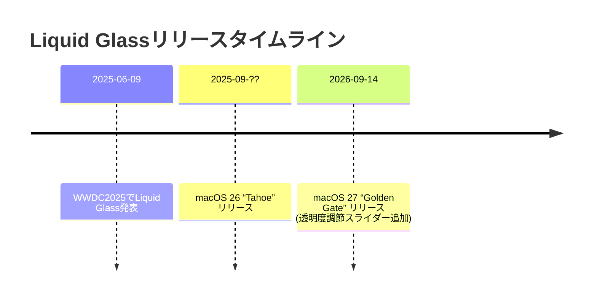

> **この文書について**（2026-09-24 追記）
>
> - ユーザーが ChatGPT の Deep Research で作成し、会話に貼った調査結果をそのまま保存したもの。
> - 本文には「推測」「不明」「非公開」とされている項目が多い。日付などにも未確認の記述がある（例: macOS 27 の名前・リリース日・透明度スライダー）。**そのまま仕様にはしない。**
> - glass-lib がこれをどう扱うか（どの部品を、どの順で作るか）は `docs/design.md` §19.1 にある。

---

# サマリー
macOS 26（Tahoe）では、新しいデザイン言語「Liquid Glass」が導入され、アプリのツールバーやサイドバー、ポップオーバーなどに光学的なガラス様の半透明エフェクトが適用されている。本レポートでは、TahoeでLiquid Glassが用いられる主要ウィジェットを網羅的に洗い出し、それぞれの**見た目**（スクリーンショット等）と**名称**、そして**Liquid Glass APIで調整可能なプロパティ**（ぼかし具合、ティントカラー、透明度、角丸、シェイプ、アニメーション動作、環境適応など）をまとめる。また、特定のコントロールが専用APIで提供されるものか、標準UIとして自動的にLiquid Glass化されるものかも区別する。さらに、**コンテキストメニュー**や**セグメント化コントロール**、**スクロール時のガラス層分割**など特殊なケース、ならびにSwiftUI標準コントロールの一覧とLiquid Glass適用の可否も列挙する。情報源としてApple公式ドキュメントやWWDCセッション資料、Tahoeのリリースノート・UI解析結果などを優先的に参照した。以下、各ウィジェットとプロパティの詳細を表形式や図解（マーメイド図）を交えて解説する。

## TahoeにおけるLiquid Glass対応ウィジェット

### **ツールバー**
- **場所／概要**：アプリウィンドウ上部のツールバー（旧タイトルバー領域）。ボタンやラベルは半透明なガラス層上に表示され、ウィンドウの丸みを帯びた角に沿って浮かぶように配置される。背景コンテンツ（壁紙やアプリ内容）がぼかし・屈折して透けて見える。
- **提供方法**：Tahoeでは標準Toolbarは自動的にLiquid Glassになる。開発者は特にAPIを呼ぶ必要はない。
- **調整可能なプロパティ**：以下のようにLiquid Glassの基本属性が関与する。多くは明示的な設定不可（Apple公表なし）。

  | プロパティ        | 説明                                                   | 既定値（または備考）                                         |
  |----------------|------------------------------------------------------|-----------------------------------------------------|
  | **マテリアル（glass variant）** | ガラスの種類（`.regular` or `.clear` 等）。                    | 通常は`regular`。（Tahoeにクリアモード設定はなく、通常半透明）   |
  | **角丸（cornerRadius）**     | 背景ガラスの角の丸み。                                       | システムウィンドウの丸みに合わせて自動（詳細不明）                  |
  | **ぼかし量（blur radius）**   | 背景のぼかし強度。                                        | 仕様非公開（Appleドキュメント未公開）                           |
  | **ティントカラー**      | ガラスに対する色づけ。主にボタンの`.tint()`等で間接的に設定可能。  | 既定では無色透明（要素自体は白系や反転色を使用）。用途に応じてアクセントでティント。 |
  | **不透明度（opacity）**    | ガラス全体の透過度。                                       | 未公開（システムデフォルト）                                   |
  | **シェイプ**         | ガラス領域の形状（丸み、長方形など）。                     | デフォルトは`.containerConcentric`風（コンテナ形状に沿う） と想定（APIで指定不可）  |
  | **アニメーション**      | 表示・消失時の動き。                                       | フェードではなく徐々に「マテリアル化」するモーション（WWDC参照）   |
  | **環境反射**        | 周囲コンテンツの色や動きへの適応度。                          | 近くの色を反射・屈折し、スクロール時には暗部で暗調整、アクセサリ（列ヘッダ等）に連動。 |

- **既定値と振る舞いメモ**：スクロールコンテンツ下に列ヘッダなど固定ビューがある場合、スクロールで色調が変わる「ハードスタイル」エフェクト（ツールバー全体で均一に効果）が使われる。暗い背景ではツールバー自体も暗い様式に切り替わる。

### **サイドバー**
- **場所／概要**：Finderやメールアプリなどのウィンドウ左端に表示されるサイドバー。Liquid Glassが面全体を覆い、背後のコンテンツや壁紙をぼかし、**近傍の色を反射**している様子が見られる。スライド可能な浮遊型サイドバー（新UI）において視差効果も可能。
- **提供方法**：標準サイドバーは自動的にLiquid Glass材質。コンテキストメニューや選択パレットも同様。
- **プロパティ**：ツールバー同様に角丸などはウィンドウに準じ、自動適応。特色として**隣接コンテンツの色がガラスに染み込む反射**効果が見られる。例：カラフルな画像などが近い場合、その色合いがサイドバーガラスににじむように映る。スクロール連動の特殊処理は通常不要。

  | プロパティ        | 説明                                                        | 既定値（または備考）                        |
  |----------------|-----------------------------------------------------------|----------------------------------------|
  | **マテリアル**         | ガラスの種類。                                               | `regular`（通常、暗部で暗調整あり）。     |
  | **角丸**            | サイドバー背景の丸み。                                         | ウィンドウに合わせて自動（詳細不明）。   |
  | **ぼかし量**         | 背景コンテンツのぼかし強度。                                     | 非公開                                     |
  | **ティント**         | カラー反射効果。                                               | 既定なし。周囲色が自然に滲む。            |
  | **環境反射**        | 近くのコンテンツによる色づけや影響度。                               | 強化される。近接コンテンツの色味や光源を拾う。 |

### **ポップオーバー／シート**
- **場所／概要**：ボタンから表示されるポップオーバーやモーダルシート（NSSheet）。背景が半透明ガラス層で覆われ、その上に追加UI（リスト選択肢やフォーム）が浮かぶ形状になる。
- **提供方法**：AppKitの`NSPopover`や`NSSheet`は自動的にLiquid Glass材質となる。SwiftUIでは`.popover`や`.sheet`を使うと自動で適用される。
- **プロパティ**：通常のガラスと同等で、角丸やぼかしは固定的。シートの場合、ウィンドウと同形状で矩形。アニメーションはポップオーバー展開時に内容がバブル状に「現れる」動きを伴う。詳細パラメータはApple未公開で「不明」とする。

  | プロパティ        | 説明                                               | 既定値（または備考）                   |
  |----------------|--------------------------------------------------|---------------------------------|
  | **マテリアル**         | ガラスの種類。                                    | `regular`（標準）。              |
  | **角丸**            | ポップオーバー・シートの角丸。                         | ウィンドウ形状に準じて丸みあり。        |
  | **ぼかし量**         | 背景ぼかし量。                                     | 非公開                               |
  | **ティント**         | カラー透過度（コンテントによる。通常無色）。            | 既定なし。                           |
  | **アニメーション**      | 表示/消失時のモーション。                             | バブル状に膨らむように現れる動作あり。 |
  | **環境反射**        | 周囲コンテンツ適応。                                  | 必要に応じて暗/明適応。               |

### **コンテキストメニュー**
- **場所／概要**：右クリックやメニューボタンで開くメニュー。選択肢が半透明ガラスの「吹き出し」上に表示される。Liquid Glassの層はメニュー背景全体を覆い、背後をぼかす。
- **提供方法**：macOSの標準コンテキストメニュー（`NSMenu`）もLiquid Glassベースに刷新されていると推測される。ボタンに紐づくドロップダウンメニューや長押しメニューも同様にガラス効果付き。
- **プロパティ**：メニューと同等の材質(`regular`)、角丸はメニューウィンドウ準拠。**Split Glass**の対象となる場合（ツールバー下の列ヘッダと連動するケースなど）には、ツールバーと同様にハードエッジ効果が適用される。詳細未公開。

  | プロパティ        | 説明                                                | 既定値（または備考）                  |
  |----------------|-------------------------------------------------|--------------------------------|
  | **マテリアル**         | ガラスの種類。                                     | `regular`。                     |
  | **角丸**            | メニュー枠の丸み。                                  | システム標準（通常わずかに丸い）。      |
  | **ぼかし量**         | 背景ぼかし量。                                    | 非公開                          |
  | **ティント**         | カラー透過。                                      | 既定なし。                        |
  | **アニメーション**      | メニュー開閉時の動作。                              | ボタンからポップアップする軽いバブル展開。   |
  | **Split Glass**   | スクロール時、他要素と連動して層が分割されるか。           | 列ヘッダ等と連動する場合はツールバーと同様の硬い分離効果あり。 |

### **セグメントコントロール**
- **場所／概要**：複数選択肢を切り替えるセグメント型ボタン群。Tahoeでは**一枚のGlassEffectContainer**が全体を包み、選択中セグメントにはさらに小さなガラス領域（色違いボックス）が重なるデザインとなっている。たとえば環境設定のウィンドウやメールアプリの「受信箱／下書き」切替などで見ることができる。
- **提供方法**：SwiftUIでは`Picker`を`.segmented`スタイルにするとそれぞれの`Button`に`.glassEffect()`を適用し、全体を`GlassEffectContainer`で囲むことで実現する。AppKitでは`NSSegmentedControl`が新デザインに合わせて再描画されている模様。
- **プロパティ**：
  - **コンテナガラス**：外枠の全体ガラスは`regular`。
  - **選択強調ガラス**：選択中セグメント内にもう一枚、用途に応じて**不透明度やティントが異なるガラス**領域が現れる設計（Apple未公開だが、`clear`相当の仕様で背後透過少なめの着色ありと推測）。
  - **間隔(spacing)**：GlassEffectContainer内のセグメント間隔を設定できる。
  - 他のプロパティは通常のボタンと同様（角丸はカプセル状、動作は標準的）。

  | プロパティ        | 説明                                          | 既定値（または備考）             |
  |----------------|---------------------------------------------|---------------------------|
  | **コンテナガラス**    | 全セグメントを包む外郭ガラス。                           | `regular`。（半透明）       |
  | **強調ガラス**     | 選択中セグメントの背景ガラス。                            | `clear`相当で色濃いめ（詳細不明）。 |
  | **間隔 (spacing)**   | ガラスコンテナ内でのボタン同士の距離（GlassEffectContainerパラメータ）。  | 未指定（デフォルト）         |
  | **その他**        | 角丸はカプセル型、スケールアニメはiOS用のみ。               |                               |

### **スクロール時のガラス層分割（Scroll Edge Effects）**
- **概要**：リストやテーブルのヘッダ下でツールバー（またはセグメント）が貼り付く場合、Liquid Glass層が**複数に分割**される挙動がある。
- **例**：SafariやMailで、上部ナビゲーションバーがスクロール固定された列ヘッダと連動するとき、ガラスが「ツールバー部」と「ヘッダ部」で分かれた硬い境界になる。逆に柔らかい通常スクロールではガラスが徐々に明瞭になるフェード効果。
- **提供方法**：自動適用。開発者は`UIScrollView`や`NSTableView`のstickyヘッダで内部実装に任せる。WWDCでは「列ヘッダを含む場合はツールバー全体に均一にエッジ効果をかけるhard styleを使う」としている。

  | 振る舞い           | 説明                                                    | 備考                        |
  |------------------|-------------------------------------------------------|---------------------------|
  | **通常スクロール**      | コンテンツ下でツールバーが徐々に浮き上がり、背景が曖昧になる。                 | contentが暗いと暗調整し、明るいと暗調整抑制。 |
  | **固定ヘッダ（Hard）** | ページ内の列ヘッダ等がツールバー下に貼り付く場合、ガラス全体で一様に色調変化を適用。 | レイヤが明瞭な硬い分離線となる        |

## SwiftUI標準コントロールへのLiquid Glass適用
SwiftUIでは多くのビューに`.glassEffect()`を適用できるが、**推奨場面はナビゲーション層のみ**とされる。以下に主なコントロールの一覧と適用可否、使用例を示す。**自動的にLiquid Glass化される要素**には注記し、任意でGlassを付与できる要素には例を挙げる。

| コントロール           | Liquid Glass化 | 適用方法・推奨例                       | 備考・プラットフォーム                                               |
|-------------------|-------------|-----------------------------------|-----------------------------------------------------------|
| **NavigationBar**    | 自動付与（iOSのみ） | SwiftUIの`NavigationStack`/.toolbarで自動的にガラス状。 | iOS 26で自動、macOSはウィンドウのツールバーとして扱われ同様にガラス化。         |
| **TabBar**           | 自動付与（iOS）    | `TabView`使用時に自動ガラス。（タブバーがLiquid Glassに）  | iPadでも同様。macOSでは通常タブバーは出ない。                                |
| **ToolbarItem**      | 自動付与（macOS）  | macOSの`.toolbar`内ボタン群は`GlassEffectContainer`で自動処理。| AppKitでは`NSToolbarItemGroup`でまとめて1つのガラス層となる。            |
| **Button**          | ○           | `.buttonStyle(.glass)`/.glassProminentや`.glassEffect()`使用。| `.glass`（半透明、2次操作向き）、`.glassProminent`（不透明、主操作向き）。`NSTexturedRoundedBezel`は新ガラスボタン、`NSButton.bezelStyle = .glass`で同様。 |
| **Toggle, Slider**    | △           | iOS 26では操作中のみガラス効果が現れる仕様。             | macOSでは通常ガラス化なし（推奨非推奨）。iOSではスライダ/トグルを操作すると反応してガラス風に。   |
| **Picker (Segmented)** | ○           | スタイル`.segmented`とともに`.glassEffect()`でガラス。    | 上記セグメント参照。`Picker`のその他スタイルでは非推奨。              |
| **DatePicker, Stepper**| ×           | 適用例なし（内容層）。                            | これらはコンテンツ層とみなされるため、ガラスエフェクトは通常使用しない。      |
| **Menu**            | ○           | `.menu`で作成したメニューは自動で新ガラスメニューに。      | macOSのNSMenuと同様の振る舞い。iOSでもアクションシート等がガラス化。|
| **Alert, Sheet, Popover** | ○       | `.alert`, `.sheet`, `.popover`はガラス背景として表示| システム提供のアラート/シート/ポップオーバー。SwiftUIでは指定不要で有効。      |
| **List, Form**       | ×           | コンテンツ層。ガラス適用は推奨外。                   | メディア・リストなどコンテンツ部分はフラットデザインを維持。               |
| **SearchBar**        | ○           | `.searchable`の検索バーは自動的にガラス背景（iOSのみ）。    | macOSでもSafari等の検索フィールドがガラス化される。                     |
| **NavigationLink**   | △           | ナビゲーション要素はツールバーではなく、中身は非推奨。        | タップ時にページ遷移は可能。見た目はLink自体にガラス効果なし。            |
| **ProgressView, Text, Image, etc.** | ×       | 内容層（ラベル、画像等）。                           | これら自体にガラスを重ねると判読性低下のため使用不可。                    |

> **主なGlass API:** SwiftUIでは`.glassEffect()`修飾子と`GlassEffectContainer`ビューでガラス層を構築する。`.glassEffect(.regular)`（デフォルト）や`.clear`、`.identity`から選び、`.tint(_:)`や`.interactive()`修飾子で色付け・反応動作を指定できる。複数要素を組む場合は必ず`GlassEffectContainer`で囲い、子要素間隔(`spacing`)を調整する。AppKitでは`NSButton.bezelStyle = .glass`や`NSToolbarItem`群でガラス効果が自動適用される。

## 参考資料
本調査では主にApple公式のWWDC資料とドキュメントを参照した。開発者向けサイトや解析ブログも情報源として活用した。各ウィジェットのプロパティ欄で「非公開」「詳細不明」とした項目は、公式資料に数値や名称が明示されていなかった点を反映している。
